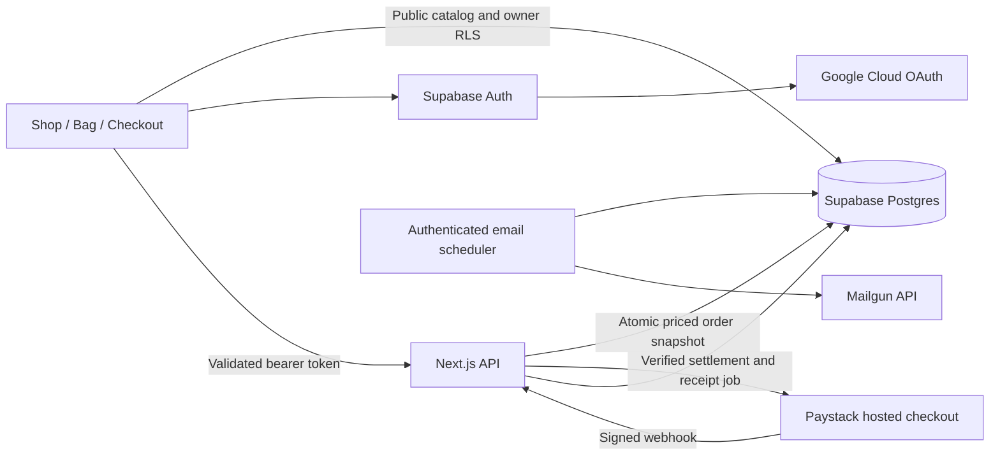

# Shop setup, step by step

The app uses Next.js App Router, Supabase Postgres and Auth, Google OAuth credentials from Google Cloud, Paystack hosted payments, and Mailgun transactional emails. Currency is NGN. Prices are integer kobo. Delivery is ₦2,500, or free at ₦50,000. The catalog includes illustrative demo products; replace product names, pricing and SVG illustrations with your actual merchandise before launch.

## 1. Supabase database

Run `supabase/migrations/001_shop.sql` once in the Supabase SQL editor of your development project, or apply it with the Supabase migration CLI. This creates new `shop_` tables and preserves the prototype `orders` table. Existing prototype orders are not migrated automatically. Products, profiles, signed-in carts, orders, line items, payment references and email jobs are stored in Postgres.

RLS gives each account access to its own cart, profile and order history. Catalog reads are public. Order creation, payment settlement and the email outbox are server-only. Never disable RLS or expose the service-role key in a `NEXT_PUBLIC_` variable. Manage your catalog in the Supabase table editor; there is no admin dashboard in this implementation. Quantities are limited to 99 per product; inventory counts and stock reservations are not implemented.

Copy the missing variables from `.env.example` into `.env.local`, preserving your existing values. Get the project URL, publishable key and service-role key from your Supabase project settings. Restart Next.js after environment changes. Do not paste secrets into chat or commit `.env.local`.

## 2. Google Cloud and Supabase Auth

In Google Cloud, create a project and configure Google Auth Platform branding, audience and clients. Request the basic `openid`, `email`, and `profile` scopes. For testing, add your own Google account to the test users. Create a Web Application OAuth client with these settings:

- Authorized JavaScript origins: `http://localhost:3000` and your production origin.
- Authorized redirect URI: `https://YOUR_PROJECT.supabase.co/auth/v1/callback` (use the exact callback shown in Supabase).

In Supabase Authentication → Sign In / Providers → Google, enable Google and save the Google client ID and client secret. In Authentication → URL Configuration, set the site URL and allow these redirect URLs:

- `http://localhost:3000/**` for development.
- Your production origin with the required `/`, `/checkout`, `/orders` and `/checkout/success` paths (including reference query strings), or an appropriately scoped wildcard under your own production origin.

The existing Supabase JS browser session flow is retained. The provider completes OAuth on return; API requests send its bearer token and the server validates it with `auth.getUser`. Guest carts remain in browser storage, and merge into the database on sign-in. Google client secrets live in Supabase’s provider configuration, not in the frontend. See [Supabase Google sign-in](https://supabase.com/docs/guides/auth/social-login/auth-google).

## 3. Paystack

Set `PAYSTACK_SECRET_KEY` to a **test** secret and `APP_URL=http://localhost:3000`. No public payment key is needed for the hosted redirect flow. Enable NGN on the Paystack account. Deploy to an HTTPS test origin or use an HTTPS tunnel and set `APP_URL` to that origin to receive webhooks.

In Paystack Settings → API Keys & Webhooks, set the test webhook URL to `https://YOUR_ORIGIN/api/payments/webhook`. The server supplies the callback URL `APP_URL/checkout/success` when initializing each transaction. The webhook authenticates the raw payload using HMAC SHA512 and re-verifies payment through Paystack’s API. Amount, currency, reference and payer email must match the stored order before it becomes paid. A callback without verified payment never marks an order paid. See [Paystack verification](https://paystack.com/docs/payments/verify-payments/) and [webhooks](https://paystack.com/docs/payments/webhooks/).

Repeat checkout submissions with the same checkout key reuse the same order and payment link. Pending orders remain visible under Orders. If initialization reaches Paystack but its response is lost before the payment URL is saved, that reference may already exist at Paystack: inspect/reconcile it in the Paystack dashboard before starting a new attempt. Never blindly retry a charge. No refund, dispute or fulfilment workflow is included.

## 4. Mailgun and email retries

Verify your Mailgun sending domain and its DNS records. Set `MAILGUN_API_KEY`, `MAILGUN_DOMAIN`, `MAILGUN_FROM`, and `MAILGUN_REGION` (`US` or `EU`). Sandbox domains only send to authorized recipients; add your test account there. See [Mailgun sending API](https://documentation.mailgun.com/docs/mailgun/api-reference/send/mailgun/messages/post-v3--domain-name--messages).

Payment settlement atomically queues a receipt in `shop_email_outbox`. The browser verification route attempts delivery immediately; webhook processing leaves delivery to the retry worker so it can acknowledge promptly. Failed email never reverses payment. A database lease prevents simultaneous workers from sending the same job. `sent` means Mailgun accepted the message; bounce/delivery tracking is not implemented. A process crash after Mailgun accepts but before the database records success can cause a duplicate receipt on retry.

Configure a scheduler to POST to `APP_URL/api/jobs/email` every minute with `Authorization: Bearer YOUR_CRON_SECRET`. Set a long randomly generated `CRON_SECRET` server-side. This endpoint processes up to five jobs concurrently per invocation, with a requested maximum duration of 60 seconds; confirm your Node host supports that duration. A hosted scheduler is required; adding the endpoint alone does not schedule it. Monitor pending jobs, attempts and `last_error` in Supabase.

## 5. Run and validate

```sh
npm install
npm run dev
npm run lint
npm run test
npm run build
```

1. Confirm the six seeded products appear; search and filter the collection.
2. Add products as a guest, refresh, adjust quantities, and remove a line.
3. Sign in with Google; verify your guest bag merges into your saved account cart. Open another browser and verify the account cart is persisted.
4. Enter a delivery address and continue to Paystack. Use the official test payment methods supplied by Paystack.
5. Verify the callback reports payment received, the order and immutable line items are stored, and the purchased unchanged cart lines are removed.
6. Confirm Mailgun accepts the receipt. Simulate email failure and run the authenticated retry endpoint after restoring credentials.
7. Replay the same webhook: it must leave one paid order and one outbox job. A forged signature must return 401.
8. Cancel payment: the order remains pending, no receipt is sent, and the cart remains. Use Orders to continue payment or check status.
9. Verify a second account cannot read or modify the first account’s records. Test the migration’s RLS and RPC permissions directly in your development Supabase project.

The local payment tests mock external APIs and database access; they do not prove the remote SQL migration, OAuth console settings, DNS or live payment configuration. Complete the service checks above before switching to live keys.

## Architecture


